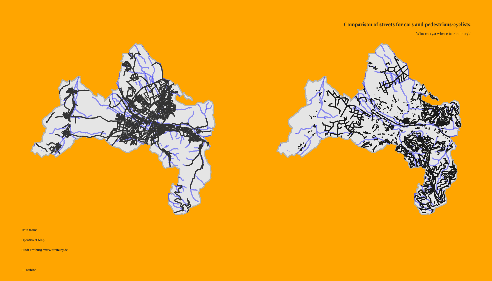

# Who has more ways to go?

How many roads are there specifically for cars and how many for people who go by foot or bicycle? Can you find which map belongs to which group?

The ways were received by using OSM data with the package `osmextract` in R. The groups for for the ways for cars I used are `c("primary", "secondary", "tertiary", "trunk", "residential", "primary_link", "secondary_link", "tertiary_link", "trunk_link",   "tertiary_link", "unclassified")`.

The elements of pedestrians are `c("pedestrian", "living_street", "footway", "path", "track", "steps", "cycleway")`.

> Of course this is a little bit exagerated, there are still the sidewalks and sometimes bicycles are allowed on the streets. Still it's interesting to see how a city is planned for cars. At least the pedestrians have the forests to go to, nice!
